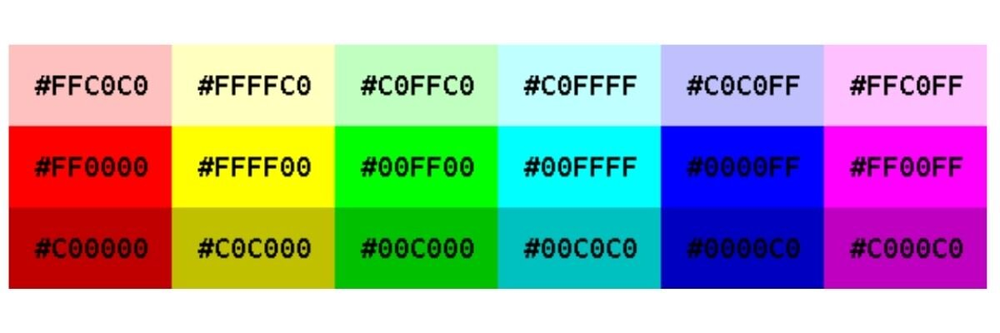

# Интерпретатор изотерического языка программирования Piet 
## Гагарина Александра ФТ-103

### Пиет - изотерический язык программирования, в котором программы - это изображения
Команды определяются переходами между цветовыми блоками, разницей оттенка и яркости

в Piet 18 официальных цветов + черный и белый

#### Принцип работы интерпретатора:
* загружаем изображение
* делим изображение на однородные цветовые блоки
  (чтобы собрать каждый блок используем классический алгоритм обхода графа в ширину или глубину)
* далее начинаем движение с левого верхнего угла

    DP: 4 направление - лево/верх/право/низ

    CC: лево или право относительно направления DP
* По цветовым переходам определяем команду
* И с помощью стека их обрабатываем

### Примеры:

Классический и самый простой способ написать на piet программу, выводящую на консоль Hello, World!

Из этой же серии - программа выводит на консоль Hello

Здесь уже сообщение идет с небольшой ошибкой. Вместо Hello появляется сообщение с опечаткой. Впрочем, так и задумано.

Окружность. Программа считает ее площадь

Ряд Фибоначчи. Каждое следующее число - сумма двух других

Деление на ноль. В данном случае выводит 0 на экран

#### и так далее...

## файловая система проекта
* `piet.py` - основной файл, через который происходит запуск
* `piet_colors.py` - файл, содержащий словарь цветов и команд
* `piet_interpreter.py` - сам интерпретатор, собирающий цветовые блоки, осуществляющий переход между ними и извлекающий команды